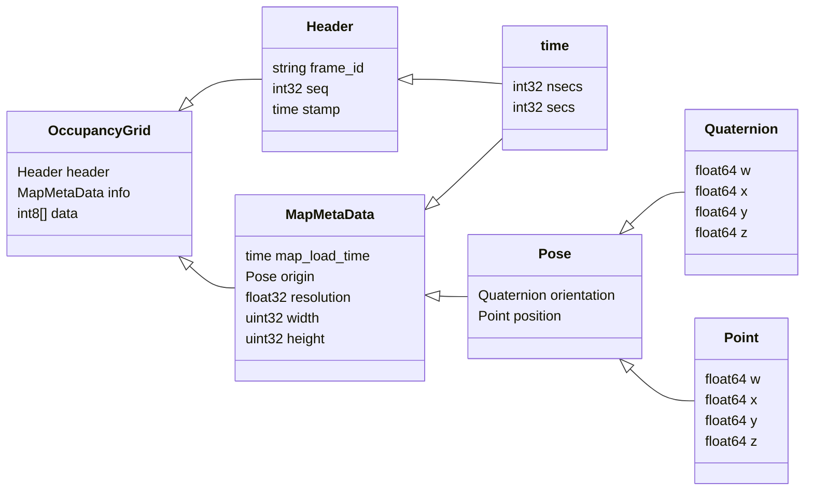
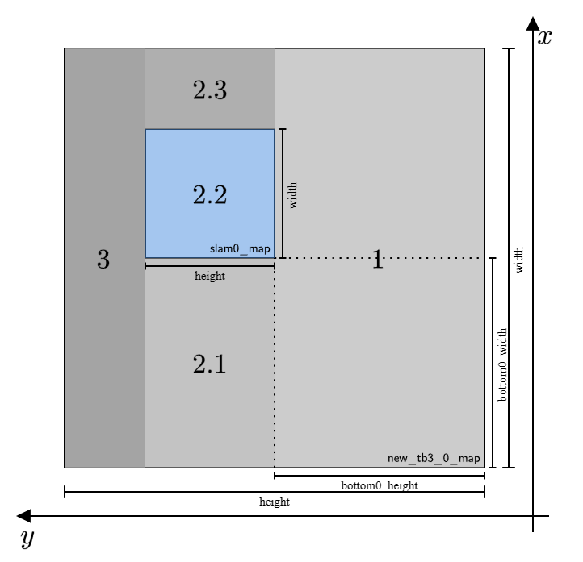

# HOW IT WORKS

## AUTO_MAPPING

Launch the `two_tb_exploration.launch` file to start the auto-mapping process.

- Initialize the following parameters:
    - `model`: The model of the robots, in this case they are turtlebots `waffle_pi`.
    - `first_tb3`and `second_tb3`: The name of the two turtlebots.
    - `known_initial_pos`: If the initial position of the robots is known.
    - `first_tb3_x_pos`, `first_tb3_y_pos`: The initial position of the first turtlebot.
    - `second_tb3_x_pos`, `second_tb3_y_pos`: The initial position of the second turtlebot.
- Run the node [`map_node`](#map_node) from the `multi_robot_exploration` package.
- Run the launch file `spawn_robots.launch` from the `multi_robot_exploration` package to spawn the two turtlebots.
    - `first_tb3_x_pos`, `first_tb3_y_pos`: The initial position of the first turtlebot.
    - `second_tb3_x_pos`, `second_tb3_y_pos`: The initial position of the second turtlebot.
- Run the launch file `slam_online_synch.launch` from the `multi_robot_exploration` package to start the SLAM process for the two turtlebots.
    - `ns`: The namespace of each turtlebot.
- Run the launch file `multi_robot_map_merge.launch` from the `multi_robot_exploration` package to merge the maps of the two turtlebots.
    - `known_initial_pos`: If the initial position of the robots is known.
- Run the node `rviz` to visualize the map.
- Run the launch file `modified_move_base.launch` from the `multi_robot_exploration` package to start the navigation process for the two turtlebots.
    - `ns`: The namespace of each turtlebot.
- Run the node `tb3_0_FE` and `tb3_1_FE` from the `multi_robot_exploration` package to start the frontier exploration process for the two turtlebots.
- Run some `static_transform_publisher` nodes to publish the transformation between the two turtlebots and the map frame.
    - From `/tb3_ns/base_footprint` to `/tb3_ns/tb3_ns/base_footprint`.
    - From `/tb3_ns/tb3_ns/base_scan` to `/tb3_ns/base_scan`.


### map_node

The `map_node` is a node from the `multi_robot_exploration` package that is used to read the robots local SLAM map and create a larger map to be used for the `map_merge` node.



**Figure 1:** The `nav_msgs/OccupancyGrid` message structure.



**Figure 2:** The map expansion process.

Pseudo code for the `map_node`:
```
CREATE slam0_map, slam1_map (nav_msgs/OccupancyGrid)

map0callback:
    slam0_map = msg

map1callback:
    slam1_map = msg

main:
    INITIALIZE map_expansion_node

    PUBLISH new_tb3_0_map, new_tb3_1_map
    SUBSCRIBE tb3_0/map CALLBACK map0callback
    SUBSCRIBE tb3_1/map CALLBACK map1callback

    WHILE ros::ok
        IF (slam0_map OR slam1_map) are NOT empty
            CREATE new_tb3_0_map, new_tb3_1_map (nav_msgs/OccupancyGrid)
            SET new_tb3_0_map, new_tb3_1_map:
                header.frame_id = "new_tb3_*_map"
                info.resolution = 0.05
                info.origin.position.x = -10.0
                info.origin.position.y = -10.0
                info.origin.position.z = 0.0
                info.origin.orientation.w = 0.0
                info.width = 384
                info.height = 384
            
            FILL new_tb3_0_map, new_tb3_1_map
                FROM (0, 0) TO (width, bottom*_height) WITH -1
                FROM (0, bottom*_height) TO (bottom*_width, bottom*_height+height) WITH -1
                FROM (bottom*_width, bottom*_height) TO (bottom*_width+width, bottom*_height+height) WITH slam*_map
                FROM (bottom*_width+width, bottom*_height) TO (width, bottom*_height+height) WITH -1
                FROM (0, bottom*_height+height) TO (width, height) WITH -1 
        
            PUBLISH new_tb3_0_map, new_tb3_1_map
        
        ros::spinOnce
```
