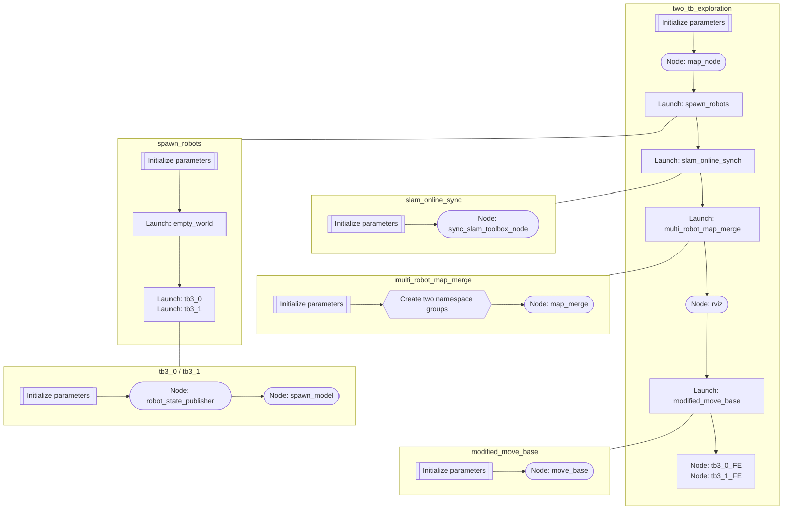
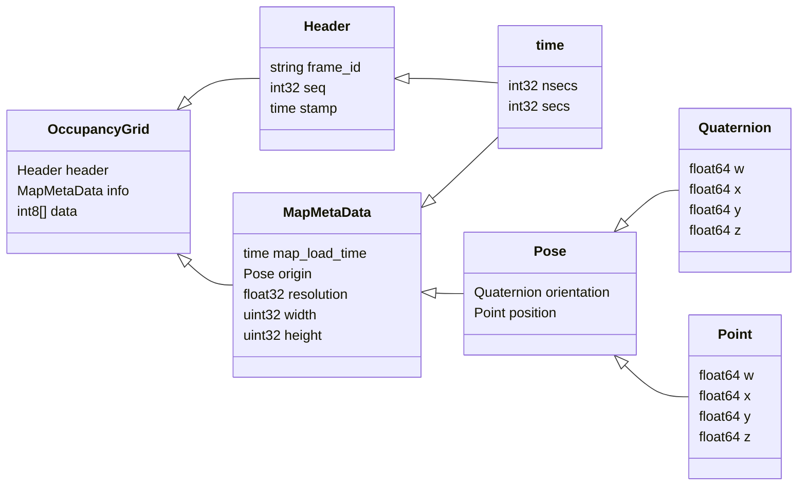
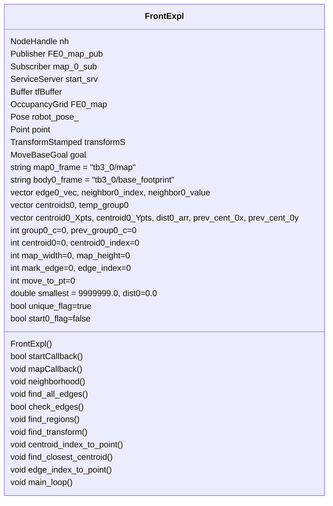

# HOW IT WORKS

Automated exploration from the `multi_robot_exploration` package is a process that allows multiple robots to explore an unknown environment.

## LAUNCH FILES

### two_tb_exploration.launch

- Initialize the following parameters:
    ```xml
    <arg name="model" default="$(env TURTLEBOT3_MODEL)" doc="model type [burger, waffle, waffle_pi]"/>
    <arg name="first_tb3"  default="tb3_0"/>
    <arg name="second_tb3" default="tb3_1"/>
    <arg name="known_initial_pos" default="true"/>

    <arg name="first_tb3_x_pos" default="-7.0"/>
    <arg name="first_tb3_y_pos" default=" -1.0"/>

    <arg name="second_tb3_x_pos" default=" 7.0"/>
    <arg name="second_tb3_y_pos" default=" -1.0"/>
    ```
- Run the node [**map_node**](#map_node).
    ```xml
    <node pkg="multi_robot_exploration" type="map_node" name="multi_robot_exploration_map_node"/>
    ```
- Run the launch file [**spawn_robots.launch**](#spawn_robotslaunch) to spawn the two turtlebots in Gazebo.
    ```xml
    <include file="$(find multi_robot_exploration)/launch/spawn_robots.launch">
        <arg name="first_tb3_x_pos" value="$(arg first_tb3_x_pos)"/>
        <arg name="first_tb3_y_pos" value="$(arg first_tb3_y_pos)"/>

        <arg name="second_tb3_x_pos" value="$(arg second_tb3_x_pos)"/>
        <arg name="second_tb3_y_pos" value="$(arg second_tb3_y_pos)"/>
    </include>
    ```
- Run the launch file [**slam_online_synch.launch**](#slam_online_synchlaunch) to start the SLAM process for the two turtlebots.
    ```xml
    <include file = "$(find multi_robot_exploration)/launch/slam_online_synch.launch">
        <arg name="ns" value="$(arg first_tb3)"/>
    </include>
    
    <include file = "$(find multi_robot_exploration)/launch/slam_online_synch.launch">
        <arg name="ns" value="$(arg second_tb3)"/>
    </include>
    ```
- Run the launch file [**multi_robot_map_merge.launch**](#multi_robot_map_mergelaunch) to merge the maps of the two turtlebots.
    ```xml
    <include file="$(find multi_robot_exploration)/launch/multi_robot_map_merge.launch">
        <arg name="known_initial_pos" value="$(arg known_initial_pos)"/>
    </include>
    ```
- Run the node [**rviz**](https://github.com/ros-visualization/rviz.git) to visualize the map.
    ```xml
    <node pkg="rviz" type="rviz" name="rviz" args="-d $(find multi_robot_exploration)/config/two_tb.rviz"/>
    ```
- Run the launch file [**modified_move_base.launch**](#modified_move_baselaunch) to start the navigation process for the two turtlebots.
    ```xml
    <group ns="$(arg first_tb3)">
        <include file="$(find multi_robot_exploration)/launch/modified_move_base.launch">
            <arg name="ns" value="$(arg first_tb3)" />
        </include>
    </group>

    <group ns="$(arg second_tb3)">
        <include file="$(find multi_robot_exploration)/launch/modified_move_base.launch">
            <arg name="ns" value="$(arg second_tb3)" />
        </include>
    </group>
    ```
- Run the node [**tb3_0_FE**](#tb3__fe) and [**tb3_1_FE**](#tb3__fe) to start the frontier exploration process for the two turtlebots.
    ```xml
    <node pkg="multi_robot_exploration" type="tb3_0_FE" name="tb3_0_FE" />
    <node pkg="multi_robot_exploration" type="tb3_1_FE" name="tb3_1_FE" />
    ```
- Run some [**static_transform_publisher**]() nodes to publish the transformation between the two turtlebots and the map frame.
    ```xml
    <node pkg="tf2_ros" type="static_transform_publisher"
        name="double_$(arg first_tb3)_tf_broadcaster_base_footprint"
        args="0 0 0 0 0 0 /$(arg first_tb3)/base_footprint /$(arg first_tb3)/$(arg first_tb3)/base_footprint " />
    <node pkg="tf2_ros" type="static_transform_publisher"
        name="double_$(arg first_tb3)_tf_broadcaster_scan"
        args="0 0 0 0 0 0 /$(arg first_tb3)/$(arg first_tb3)/base_scan /$(arg first_tb3)/base_scan " />

    <node pkg="tf2_ros" type="static_transform_publisher"
        name="double_$(arg second_tb3)_tf_broadcaster_base_footprint"
        args="0 0 0 0 0 0 /$(arg second_tb3)/base_footprint /$(arg second_tb3)/$(arg second_tb3)/base_footprint " />
    <node pkg="tf2_ros" type="static_transform_publisher"
        name="double_$(arg second_tb3)_tf_broadcaster_scan"
        args="0 0 0 0 0 0 /$(arg second_tb3)/$(arg second_tb3)/base_scan /$(arg second_tb3)/base_scan " />
    ```

### spawn_robots.launch

- Initialize the following parameters:
    ```xml
    <arg name="first_tb3_x_pos" default="-7.0" />
    <arg name="first_tb3_y_pos" default=" -1.0" />

    <arg name="second_tb3_x_pos" default=" 7.0" />
    <arg name="second_tb3_y_pos" default=" -1.0" />

    <arg name="init_pose_0" default="-x $(arg first_tb3_x_pos) -y $(arg first_tb3_y_pos) -z 0.0" />
    <arg name="init_pose_1" default="-x $(arg second_tb3_x_pos) -y $(arg second_tb3_y_pos) -z 0.0" />
    ```
- Run the launch file [**empty_world.launch**](https://wiki.ros.org/gazebo) to start the Gazebo simulation.
    ```xml
    <include file="$(find gazebo_ros)/launch/empty_world.launch">
        <arg name="world_name" value="$(find multi_robot_exploration)/worlds/bookstore.world" />
        <arg name="paused" value="false" />
        <arg name="use_sim_time" value="true" />
        <arg name="gui" value="true" />
        <arg name="headless" value="false" />
        <arg name="debug" value="false" />
    </include>
    ```
- Run the launch file [**tb3_0.launch**](#tb3_launch) to spawn the first turtlebot.
    ```xml
    <group ns="tb3_0">
        <param name="tf_prefix" value="tb3_0" />
        <include file="$(find multi_robot_exploration)/launch/tb3_0.launch">
            <arg name="init_pose" value="$(arg init_pose_0)" />
            <arg name="robot_name" value="tb3_0" />
        </include>
    </group>
    ```
- Run the launch file [**tb3_1.launch**](#tb3_launch) to spawn the second turtlebot.
    ```xml
    <group ns="tb3_1">
        <param name="tf_prefix" value="tb3_1" />
        <include file="$(find multi_robot_exploration)/launch/tb3_1.launch">
            <arg name="init_pose" value="$(arg init_pose_1)" />
            <arg name="robot_name" value="tb3_1" />
        </include>
    </group>
    ```

### slam_online_synch.launch

- Initialize the following parameters:
    ```xml
    <arg name="ns" default="tb3_0"/>
    ```
- Run the node [**sync_slam_toolbox_node**](#sync_slam_toolbox_node) to synchronize the SLAM process for the two turtlebots and remap some topics.
    ```xml
    <node pkg="slam_toolbox" type="sync_slam_toolbox_node" name="slam_toolbox_$(arg ns)" output="screen">
        <rosparam command="load" file="$(find multi_robot_exploration)/config/mapper_params_online_sync.yaml" />
        <param name="base_frame" value="$(arg ns)/base_footprint"/>
        <param name="odom_frame" value="$(arg ns)/odom"/>
        <param name="map_frame"  value="$(arg ns)/map"/>
        <remap from="/map" to="$(arg ns)/map"/>
        <remap from="/scan" to="$(arg ns)/scan"/>
        <remap from="/initialpose" to = "/initialpose_$(arg ns)"/>
    </node>
    ```

### multi_robot_map_merge.launch

- Initialize the following parameters:
    ```xml
    <arg name="known_initial_pos" default="true"/>

    <arg name="first_tb3"  default="tb3_0"/>
    <arg name="second_tb3" default="tb3_1"/>

    <arg name="first_tb3_x_pos" default="-7.0"/>
    <arg name="first_tb3_y_pos" default=" -1.0"/>
    <arg name="first_tb3_z_pos" default=" 0.0"/>
    <arg name="first_tb3_yaw"   default=" 0.0"/>

    <arg name="second_tb3_x_pos" default=" 7.0"/>
    <arg name="second_tb3_y_pos" default=" -1.0"/>
    <arg name="second_tb3_z_pos" default=" 0.0"/>
    <arg name="second_tb3_yaw"   default=" 0.0"/>
    ```
- Create two groups with the following parameters.
    ```xml
    <group ns="$(arg first_tb3)/map_merge">
        <param name="init_pose_x"   value="$(arg first_tb3_x_pos)"/>
        <param name="init_pose_y"   value="$(arg first_tb3_y_pos)"/>
        <param name="init_pose_z"   value="$(arg first_tb3_z_pos)"/>
        <param name="init_pose_yaw" value="$(arg first_tb3_yaw)"  />
    </group>

    <group ns="$(arg second_tb3)/map_merge">
        <param name="init_pose_x"   value="$(arg second_tb3_x_pos)"/>
        <param name="init_pose_y"   value="$(arg second_tb3_y_pos)"/>
        <param name="init_pose_z"   value="$(arg second_tb3_z_pos)"/>
        <param name="init_pose_yaw" value="$(arg second_tb3_yaw)"  />
    </group>
    ```
- Run the node [**map_merge**](#map_merge) to merge the maps of the two turtlebots and do some remapping.
    ```xml
    <node pkg="multirobot_map_merge" type="map_merge" respawn="false" name="map_merge">
        <param name="robot_map_topic" value="map"/>
        <param name="robot_namespace" value="tb3"/>
        <param name="merged_map_topic" value="map"/>
        <param name="world_frame" value="map"/>
        <param name="known_init_poses" value="$(arg known_initial_pos)"/>
        <param name="merging_rate" value="0.5"/>
        <param name="discovery_rate" value="0.05"/>
        <param name="estimation_rate" value="0.1"/>
        <param name="estimation_confidence" value="1.0"/>

        <remap from = "$(arg first_tb3)/map" to = "new_tb3_0_map"/>
        <remap from = "$(arg second_tb3)/map" to = "new_tb3_1_map"/>
    </node>
    ```
- Run some [**static_transform_publisher**](https://github.com/ros/geometry.git) nodes to publish the transformation between the two turtlebots and the map frame.
    ```xml
    <node pkg="tf" type="static_transform_publisher" 
        name="world_to_$(arg first_tb3)_tf_broadcaster"  
        args="0 0 0 0 0 0 /map /$(arg first_tb3)/map 100"/>
    <node pkg="tf" type="static_transform_publisher" 
        name="world_to_$(arg second_tb3)_tf_broadcaster" 
        args="0 0 0 0 0 0 /map /$(arg second_tb3)/map 100"/>
    <node pkg="tf" type="static_transform_publisher" 
        name="world_to_new_$(arg first_tb3)_map" 
        args="0 0 0 0 0 0 /map /new_tb3_0_map 100"/>
    <node pkg="tf" type="static_transform_publisher" 
        name="world_to__new_$(arg second_tb3)_map" 
        args="0 0 0 0 0 0 /map /new_tb3_1_map 100"/>
    ```

### modified_move_base.launch

- Initialize the following parameters:
    ```xml
    <arg name="ns" default="tb3_0"/>
    <arg name = "robot_base_frame" default = "$(arg ns)/base_footprint"/>
    <arg name="move_forward_only" default="false"/>
    ```
- Run the node [**move_base**](https://github.com/ros-planning/navigation.git) to start the navigation process for the two turtlebots and do some remapping
    ```xml
    <node pkg="move_base" type="move_base" respawn="false" name="move_base" output="screen">
        <param name="base_local_planner" value="dwa_local_planner/DWAPlannerROS" />
        <rosparam file="$(find turtlebot3_navigation)/param/costmap_common_params_burger.yaml" 
            command="load" ns="global_costmap"/>
        <rosparam file="$(find turtlebot3_navigation)/param/costmap_common_params_burger.yaml" 
            command="load" ns="local_costmap" />
        <rosparam file="$(find multi_robot_exploration)/config/local_costmap_params_$(arg ns).yaml"  
            command="load" />
        <rosparam file="$(find multi_robot_exploration)/config/global_costmap_params_$(arg ns).yaml" 
            command="load" />
        <rosparam file="$(find turtlebot3_navigation)/param/base_local_planner_params.yaml" 
            command="load" />
        <rosparam file="$(find turtlebot3_navigation)/param/move_base_params.yaml" 
            command="load" />
        <rosparam file="$(find turtlebot3_navigation)/param/dwa_local_planner_params_burger.yaml" 
            command="load" />

        <remap from="robot_base_frame" to="$(arg ns)/base_footprint"/>
        <remap from="/map" to="$(arg ns)/map"/>
    </node>
    ```

### tb3_*.launch

- Initialize the following parameters:
    ```xml
    <arg name="robot_name"/>
    <arg name="init_pose"/>
    <param name="robot_description" 
        command="$(find xacro)/xacro --inorder $(find multi_robot_exploration)/urdf/tb3_0.urdf.xacro" />
    ```
- Run the node [**robot_state_publisher**](https://github.com/ros/robot_state_publisher.git) to publish the state of the first turtlebot.
    ```xml
    <node pkg="robot_state_publisher" type="robot_state_publisher" name="robot_state_publisher_0" output="screen">
        <param name="publish_frequency" type="double" value="50.0" />
    </node>
    ```
- Run the node [**spawn_model**](https://wiki.ros.org/gazebo) to spawn the first turtlebot.
    ```xml
    <node pkg="gazebo_ros" type="spawn_model" name="spawn_urdf_0"
        args="$(arg init_pose) -urdf -model $(arg robot_name) -param robot_description"/>
    ```

**Figure 1:** The `two_tb_exploration` launch file flowchart.

## NODE FILES

### map_node

The `map_node` is a node from the `multi_robot_exploration` package that is used to read the robots local SLAM map and create a larger map to be used for the `map_merge` node.



**Figure 2:** The `nav_msgs/OccupancyGrid` message structure.


**Figure 3:** The map expansion process.

Pseudo code for the `map_node`:
```
CREATE slam0_map, slam1_map (nav_msgs/OccupancyGrid)

map0callback:
    SET slam0_map : msg

map1callback:
    SET slam1_map : msg

main:
    INITIALIZE map_expansion_node

    PUBLISH new_tb3_0_map, new_tb3_1_map
    SUBSCRIBE tb3_0/map CALLBACK map0callback
    SUBSCRIBE tb3_1/map CALLBACK map1callback

    WHILE ros::ok
        IF (slam0_map OR slam1_map) are NOT empty
            CREATE new_tb3_0_map, new_tb3_1_map (nav_msgs/OccupancyGrid)

            SET new_tb3_0_map, new_tb3_1_map:
                header.frame_id = "new_tb3_*_map"
                info.resolution = 0.05
                info.origin.position.x = -10.0
                info.origin.position.y = -10.0
                info.origin.position.z = 0.0
                info.origin.orientation.w = 0.0
                info.width = 384
                info.height = 384
            
            FILL new_tb3_0_map, new_tb3_1_map
                FROM (0, 0) TO (width, bottom*_height) WITH -1
                FROM (0, bottom*_height) TO (bottom*_width, bottom*_height+height) WITH -1
                FROM (bottom*_width, bottom*_height) TO (bottom*_width+width, bottom*_height+height) WITH slam*_map
                FROM (bottom*_width+width, bottom*_height) TO (width, bottom*_height+height) WITH -1
                FROM (0, bottom*_height+height) TO (width, height) WITH -1 
        
            PUBLISH new_tb3_0_map, new_tb3_1_map
        
        ros::spinOnce
```

### tb3_*_FE

The `tb3_0_FE` is a node from the `multi_robot_exploration` package that is used to explore the environment and find the frontiers for the first turtlebot.


**Figure 3:** The `tb3_0_FE` class structure.

Pseudo code for the `tb3_0_FE`:

Class **FrontExpl**

**FrontExpl**
1. Publish the **edges_map_0** topic
2. Subscribe to the **map** topic with the **mapCallback** callback
3. Create a service server **start_srv** with the **startCallback** callback

**mapCallback**
1. Set the *FE0_map* to the received message
2. Change its *frame_id* to "edges_map_0"

**startCallback**
1. Set the *start0_flag* to true

**main_loop**
1. Define a MoveBaseClient object *ac* to "tb3_0/move_base"
2. Wait for the *move_base* action server to come up
3. Define a TransformListener object *tfListener*
4. Enter the while loop
    1. If the *FE0_map* is not empty and the *start0_flag* is true
        1. Obtain the map width and height from the *FE0_map*
        2. Find the frontier edges with the **find_all_edges** function
        3. If there are not any edges, *edge0_vec* is empty
            1. Go to **skip**
        4. Sort the edges in ascending order and remove duplicates
        5. Publish the *FE0_map* to the **edges_map_0** topic
        6. Given the edges, find the regions with the **find_regions** function
        7. Find the transform between the map and the robot with the **find_transform** function
        8. Given the centroids, convert them to points with the **centroid_index_to_point** function
        9. If there are not any centroids, *centroids0_Xpts* and *centroids0_Ypts* are empty, go to the closest frontier point
            1. Clear both *centroids0_Xpts* and *centroids0_Ypts*
            2. Clear the *dist0_arr* vector
            3. Given the edge vector, convert them to points with the **edge_index_to_point** function
        10. Of the centroids, find the closest one to the robot with the **find_closest_centroid** function
        11. Add the current centroid to the *prev_cent_0x* and *prev_cent_0y* vectors
        12. Determine the move_base goal with a frame of "tb3_0/map" and a position of the current centroid
        13. Send the goal to the move_base action server
        14. Wait for the result of the goal
    2. **skip**:
        1. Sleep for 1 second
        2. Continue to the next iteration
        3. Resetting all the variables and vectors

**find_all_edges**
1. Iterate through the *FE0_map* from the inside bottom right corner to the inside top left corner
    1. If the cell is unknown
        1. Check neighbors with the **neighborhood** function
        2. Iterate through the neighbors
            1. If the neighbor is free, its value is 0
                1. Store the index of the neighbor in the *edge0_vec* vector

**neighborhood** Given *cell* index
1. Clear the *neighbor0_index* and *neighbor0_value* vectors
2. Store the index of the neighbors, 8 in total, in the *neighbor0_index* vector
3. Sort the neighbors in ascending order and remove duplicates

**find_regions**
1. Iterate through the *edge0_vec* vector, which contains the frontier edges
    1. If the next edge is the same as the current edge
        1. Check the neighbors with the **neighborhood** function
        2. Iterate through the neighbors
            1. If the neighbor is a frontier edge
                1. Store the corresponding frontier edge in the *temp_group0* vector
                2. Sort the *temp_group0* vector in ascending order and remove duplicates
                3. Increment the *group0_c* counter to keep track of the region's size
        3. If we didn't add any new edges to the region, *group0_c* = *prev_group0_c*
            1. If the frontier region is big enough, *group0_c* >= 5
                1. Find the region's centroid, the middle point of the *temp_group0* vector
                2. Store the centroid in the *centroids0* vector
            2. Reset the *temp_group0* vector and *group0_c* counter
        4. Else, *prev_group0_c* = *group0_c*

**find_transform**
1. Get the transform between the *map0_frame* and the *body0_frame* in the *transformS* variable
2. Update the transform's stamp, frame_id, and child_frame_id
3. Update the robot's position and orientation from the *transformS* variable

**centroid_index_to_point**
1. Iterate through the *centroids0* vector
    1. Convert the centroid index to a point, using the map width and height
    2. Store it in the *x* and *y* elements of the *point* variable
    3. Iterate through the *prev_cent_0x* vector
        1. Calculate the distance between the current centroid and the previous centroids
        2. If the distance is too small, go to **bad_centroid**
    4. If the centroid is to close to the origin of the map, go to **bad_centroid**
    5. Else
        1. Store the *x* and *y* elements in the *centroids0_Xpts* and *centroids0_Ypts* vectors
        2. Determine the euclidean distance between the robot and the centroid
        3. Store the distance in the *dist0_arr* vector
    6. **bad_centroid**:
        1. Print a message that the centroid is not valid

**find_closest_centroid**
1. Set the *smallest* variable to a large number
2. Iterate through the *dist0_arr* vector
    1. If the distance is too small, ignore it
    2. If the distance is smaller than the *smallest* variable
        1. Update the *smallest* variable
        2. Update the index of the centroid to the *move_to_pt* variable
    3. If the distance is larger than the *smallest* variable, ignore it

**edge_index_to_point**
1. Iterate through the *edge0_vec* vector
    1. Convert the edge index to a point, using the map width and height
    2. Store it in the *x* and *y* elements of the *point* variable
    3. Store the *x* and *y* elements in the *centroids0_Xpts* and *centroids0_Ypts* vectors
    4. Determine the euclidean distance between the robot and the edge
    5. Store the distance in the *dist0_arr* vector

**main**
1. Initialize ROS node with name "tb3_0_FE"
2. Define a FrontExpl object *FE*
3. Run the **main_loop** function of the *FE* object

### map_merge

### sync_slam_toolbox_node